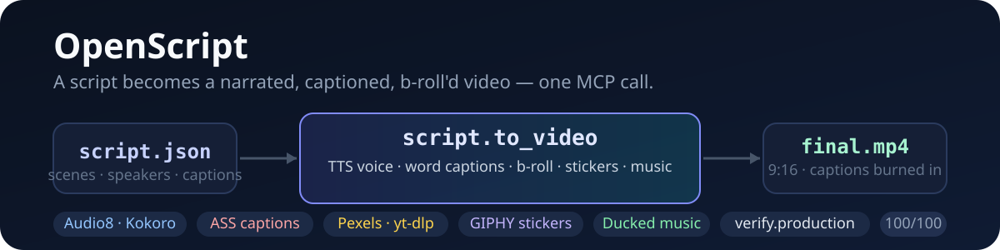
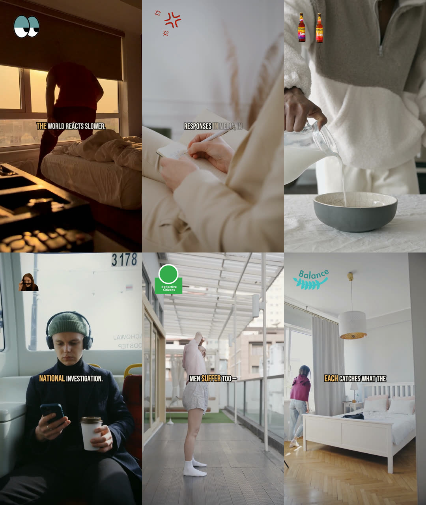

# OpenScript


**Turn any script — or any audio, or any existing footage — into a narrated, captioned, b-roll'd MP4. One MCP call.**



---

## What it does

OpenScript is an AI-directed video pipeline. You give it a script (speakers, scenes, captions), an audio file, or raw footage — it returns a finished vertical video with a cloned/neural voiceover, word-synced captions, per-scene stock b-roll, GIPHY sticker overlays, and a ducked music bed.

Real output (6 frames sampled from a script-generated video — voice clone, centered word-highlight captions, stock b-roll):



## The one-call path

```bash
script.parse    # validate the script JSON
script.to_video # ONE CALL: script → MP4
```

`script.to_video` runs the whole pipeline internally — no manual chaining:

1. **Voice** — Audio8 zero-shot voice clone (or Kokoro 54-voice presets) narrates every scene
2. **Captions** — word-level ASS captions, centered, with highlight animation
3. **B-roll** — unique stock clips per scene (Pexels → yt-dlp fallback), duration-matched, non-repeating
4. **Stickers** — GIPHY sticker overlays per speaker (keyword-relevance gated)
5. **Music** — background bed with sidechain ducking under narration
6. **Render** — FFmpeg multilayer → MP4 (HyperFrames/Remotion available as escape hatches)

## Quick start

```bash
# Requirements: Rust toolchain, ffmpeg/ffprobe 6+, yt-dlp, Python 3.11+

cargo build --release

# One-call video from a script
openscript script-to-video --script script.json --output final.mp4

# Or start the MCP server (109 tools over stdio) for an AI agent
openscript run-mcp
```

API keys (optional but unlock real stock): `PEXELS_API_KEY` (b-roll), `GIPHY_API_KEY` (stickers), `PIXABAY_API_KEY` (music/video). Without them the pipeline falls back to yt-dlp / procedural backgrounds.

## Architecture

A Rust workspace (8 crates) with Python ML sidecars and three render engines:

```
┌────────────┐   ┌────────────┐   ┌──────────────────────┐   ┌────────────┐
│  MCP tools │──▶│  Tool      │──▶│  Render engines      │──▶│  MP4       │
│  (97)      │   │  dispatch  │   │  FFmpeg multilayer*  │   │  (9:16)    │
└────────────┘   │  route_tool│   │  HyperFrames (GSAP)  │   └────────────┘
                 └────────────┘   │  Remotion (React)    │
                                   └──────────────────────┘
```

| Layer | Crate / Dir | Role |
|-------|-------------|------|
| Types & timeline | `openscript-core` | ScriptSpec, EDL v2 timeline, captions, production-quality scoring |
| Render | `openscript-ffmpeg` | Filter-graph builder, multilayer render, subtitle burn |
| Voice | `openscript-tts` | Audio8/Kokoro sidecar client, voice-profile registry |
| Transcribe | `openscript-transcribe` | Apex/Whisper STT + word alignment (Hinglish-aware) |
| Media | `openscript-assets` | Pexels client, music/SFX indexes |
| Integration | `openscript-mcp` | MCP server + tool handlers (109 tools, 27 families) |
| Binaries | `openscript-cli`, `openscript-tauri` | CLI wrapper / desktop app |
| ML sidecars | `mcp/scripts/` | Audio8 TTS, Kokoro TTS, Apex transcribe, Whisper align |
| Motion render | `hyperframes/` | HTML+GSAP composition engine (default motion graphics) |

## Trajectories

| Input | Path | Use case |
|-------|------|----------|
| Script | `script.parse → script.to_video` | From-scratch video creation (golden path) |
| Audio | `transcribe → srt.prepare → broll.auto → timeline.render` | A2V — audio to reel (Hinglish SRT supported) |
| Video | `transcribe → srt.to_timeline → broll.fetch → timeline.render` | V2V — repurpose existing footage |
| Footage | `timeline.build → timeline.add_segment → timeline.render` | NLE-style editing of existing media |

Every trajectory ends in `verify.production` — a 100-point quality gate scoring stock authenticity, music fit, caption sync, segmentation pacing, and visual repetition.

## Media sources

| Asset | Sources | Dedup / relevance |
|-------|---------|-------------------|
| B-roll | Pexels (primary) → yt-dlp/YouTube (fallback) | Video-ID dedup, min-duration coverage, concept-alias search |
| Stickers | GIPHY (transparent GIFs) | Keyword-relevance gate (agent-scored) before download |
| Music | Local library (20) → YouTube-scraped (500+) → Pixabay | Mood/energy matching, sidechain ducking |
| Images | Pexels photo API, Openverse | License-aware |

## Requirements

- Rust 2021 toolchain
- FFmpeg / ffprobe 6+
- yt-dlp (YouTube fallback + music library scraping)
- Python 3.11+ (ML sidecars: Audio8, Kokoro, Whisper alignment)
- Optional API keys: `PEXELS_API_KEY`, `GIPHY_API_KEY`, `PIXABAY_API_KEY`

## License

MIT — see [LICENSE](LICENSE).
